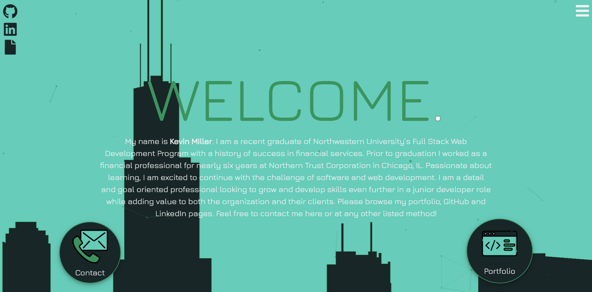

  # Kevin Miller - Portfolio

  

  ## Description
  A react application that acts as the main portfolio for my coding projects. The site relies on MongoDB to store information about the different portfolio items and receive messages from visitors. StyledComponents and Framer-Motion were used for ease of CSS and animations. I wanted to rebuild my prior portfolio using some of the new skills I had learned over the past several months. I look forward to continuing to update as I learn more!

  ## Table of Contents
  * [Installation](#installation)
  * [Usage](#usage)
  * [Contributing](#contributing)
  * [Tests](#tests)
  * [Questions](#questions)

  ## Installation 
    
  *Steps required to install package:* 
    
  N/A

  ## Usage

  *Examples of project use:*

  

  ## Contributing

  *If you are interested in contributing to this project, please follow the below instructions:*

  Pull requests not welcome at this time.

  ## Tests

  *Application tests and instructions for them:*

  N/A

  ## License

  None
  

  ## Questions

  *If you have any questions regarding this application, please utilize the below contact information:*

  [kmiller343@gmail.com](mailto:kmiller343@gmail.com)
  
  [GitHub Profile](https://www.github.com/k1te-m)
  